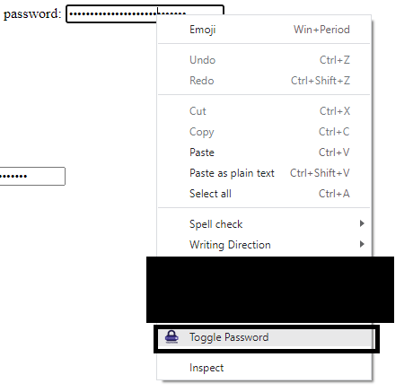

# TogglePassword

This browser extension allows you to show & hide passwords in any password entry field, and generate passwords, using the context menu.

## Why TogglePassword?

- Privacy-friendly.
- Only enabled in a context menu on password entries.
- No hidden codes.
- Open-Source.

## Chrome Extension

<https://chromewebstore.google.com/detail/bjpflbghifmlangdafcjahmlllhajicm>

## Screenshots

## Contributing

Pull requests are welcome. For major changes, please open an issue first to discuss what you would like to change.

## License

[MIT](https://choosealicense.com/licenses/mit/)
